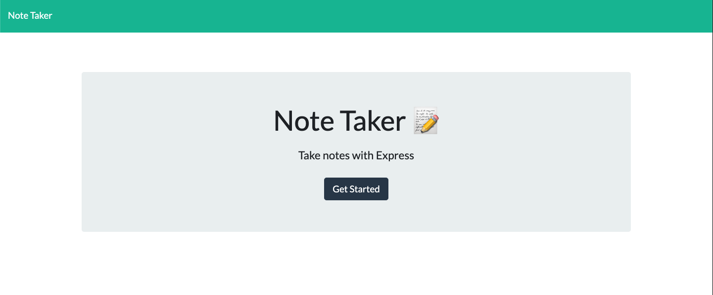
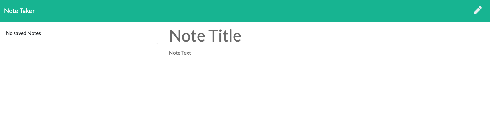

# Note Taker

## Table of Contents
1. [Description](#description)
2. [Installation Instructions](#installation-instructions)
3. [Usage](#usage)
4. [Contribution Guidelines](#contribution-guidelines)
5. [Test Instuctions](#test-instructions)
6. [License Information](#license-information)
7. [Questions](#questions)

## Description
A simple app for saving notes! Just enter a title and some descriptive text for your note and hit the save icon on the top right! That's all and you have a saved note. To access old notes, just click their name on the left hand side. Create a new note by pressing the pencil icon on the top right.

## Installation Instructions
none

## Usage
npm start - to begin the server.

## License Information
### No license

## Questions
If you have further questions you can contact us at nmp14fsu@gmail.com.

Github: nmp14

